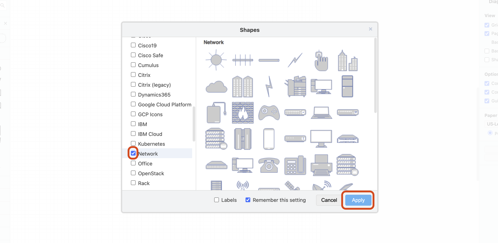

<h1>
  Build a Network Diagram Lab
  Get Familiar with Diagramming Tools
</h1>

**Learning objective:** By the end of this lesson, students will be able to navigate the basic features and functions of draw.io for creating network diagrams.

## Explore draw.io and add the Network shape library

Before diving into creating our network diagram, let's get acquainted with the tool we'll use: draw.io. Draw.io is a powerful, free, user friendly diagramming application that runs in your web browser. It's perfect for creating professional-looking network diagrams.

1. Open your web browser and go to [draw.io](https://draw.io).

2. Take a few minutes to explore the interface. Familiarize yourself with the main sections:

   - The toolbar at the top contains tools for creating and editing shapes.

   - The sidebar on the left contains various shape libraries.

   - The main canvas in the center. This is where you'll build your diagram.

3. Experiment with the following basic functions:

   - Dragging and dropping shapes from the sidebar onto the canvas.

   - Connecting shapes with lines using the connector tool.

   - Adding text to shapes and lines.

   - Moving, resizing, and deleting shapes.

4. Add the **Network** shape library to the sidebar by selecting the **+ More Shapes** button in the left sidebar. Then, select the checkbox next to the **Network** option in the **Networking** section, then select the **Apply** button. This contains many of the common shapes you'll use in your network diagram, like routers, switches, servers, and cloud symbols.

   

5. If you're new to draw.io, consider watching an introductory tutorial video to get a more guided introduction. The [draw.io YouTube Beginner Playlist](https://www.youtube.com/playlist?list=PLX6xdk86h_0xpW82Q0YkdN6xpHa6hvHjO) has some great resources.

Take your time getting comfortable with the tool. In the next exercise, we'll start thinking about the specific components of your network that you'll need to represent in your diagram.
